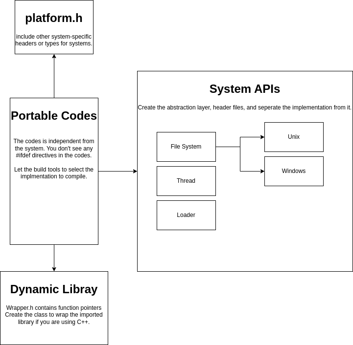

# Large Project

Warning: the code is not tested and compiled on Linux and Windows. I need to use build tools to compile codes on different platforms. Well... it's just the demo anyway.

## Compilers or Operating Systems

We need to think how many platforms our product should support, Windows, Linux, Mac, Unix-Like systems... Or the product can run on Windows, but your boss want it run on Linux or Mac in the future.

We can seperate the codes based on compilers or operating systems.

Compiler 

* msvc
* clang
* gcc

Operating systems

* Windows 
    * 32 bits
    * 64 bits
    * ARM 32 bits
    * ARM 64 bits

* Linux
    * 32 bits (not very popular)
    * 64 bits

* Mac
    * 64 bits
    * ARM 64 bits

* Unix-Like
    * Solaris 
    * AIX
    * FreeBSD
    * Power PC
    * HP

## Header Files (platform.h)

platform.h defines the macros and includes the system-specific headers. I want to put the system-specific codes into a single header file and the user just need to include a single header file. I don't want to put the #ifdef directives in other code sections. 

We can seperate the type definition to the different header files if the platform.h becomes too large.


### Generic Text

Windows supports unicode and multi-bytes characters, but most of unix-like systems support only UTF-8. Here, we only use macro to replace the low-level string functions, strcpy, fprintf... You can use them to create more generic and powerful string function. 


### Type Definition

For example, like m_linux.h.

```c
typedef char BYTE;                              /* 1 byte */
typedef int  INT32;                             /* 4 bytes */
typedef unsigned int UINT32;                    /* 4 bytes */
typedef long long int INT64;                    /* 8 bytes */
typedef unsigned long long int UINT64;          /* 8 bytes */
typedef double DOUBLE;                          /* 8 bytes */

typedef int FHANDLE;                            /* file handle */
typedef void * MHANDLE;                         /* module handle */
typedef pthread_t THANDLE;                      /* thread handle */
```

1. define the basic data type like pointer and integer because every compiler has different definition.

2. define handle, file handle, module handle, thread handle which will be different on Windows and Unix.


## Abstraction Layer

We should have the abstraction layer for these system APIs.

* filesystem.h - file operations
* thread.h - thread APIs
* path.h - file path (Windows and Unix)
* loader.h - load dynamic library 

The rest of codes will be system-independent. 


## Dynamic Library

About dynamic libraries... we should have the function pointers defined in the wrapper.h. If the function pointer is NULL, that function is not supporting the specific platform.

## Design


## Something missing...

This is just very 

### Implementation 

### Testing 

### CI/CD Process